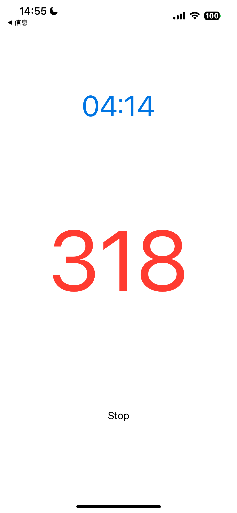
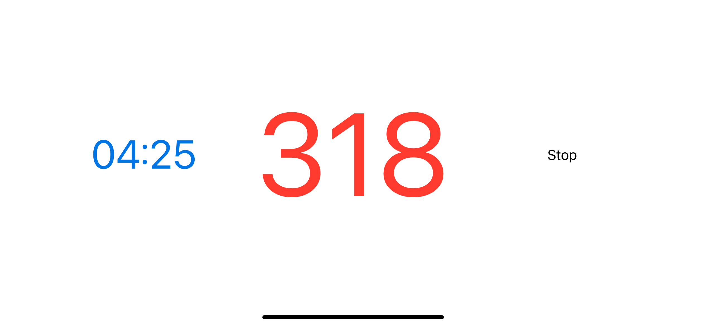
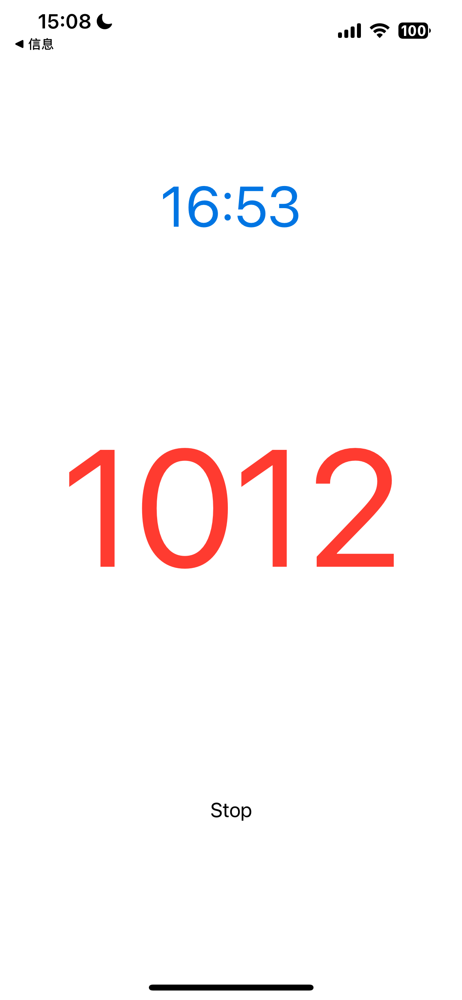

# A minimalist jump rope counting app using AirPods as sensors.

My requirement is to place my iphone on a park bench or against any wall, allowing me to listen to audiobooks while jump roping, with real-time counting and display of jump rope time.

This app do:

- Jump rope counting;
- Use AirPods as sensors;
- Display jump rope time and counts on iPhone;
- Supports both landscape and portrait orientations;
- Minimalist design with only one button: Start.
- Keeps the screen on while running in the foreground, but does not keep the screen on when not in the foreground.

APP Screenshots：

<kbd></kbd>
<kbd></kbd>

<kbd></kbd>
<kbd></kbd>

